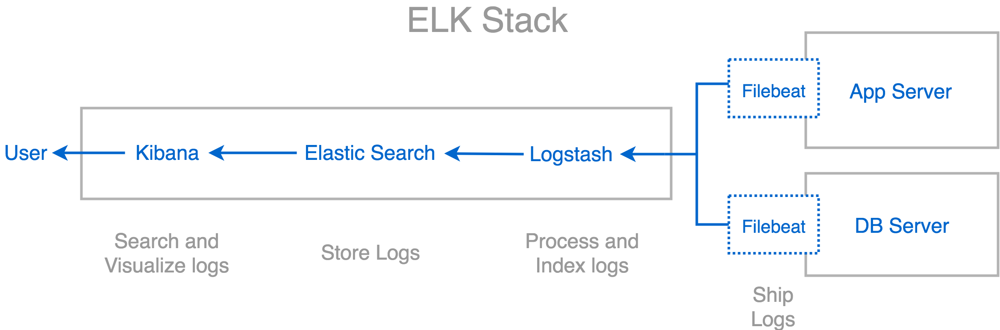

## Install 
`npm install`
## Startup
`NODE_ENV=development npm start`
## Logging
### Logging level
`NODE_ENV=development LOGGING_LEVEL=debug npm start`
### Logging directory
The logging directory is specified using the `LOGGING_DIRECTORY` variable in the config file.

## Configuration
Uses separate config files in `/config` for each environment i.e `development`,`test`, and `production`

## ELK Stack


####Install Elasticsearch
Install from `https://www.elastic.co/downloads/elasticsearch`
Run Elasticsearch:  `bin/elasticsearch`
Elasticsearch will be running in `http://localhost:9200/`

####Install Kibana
Install from `https://www.elastic.co/downloads/kibana`
Run Kibana:  `bin/kibana`
Kibana will be running in `http://localhost:5601/`

####Install Logstash
Install from `https://www.elastic.co/downloads/logstash`

#####Configuring Logstash: 
Let's step through creating a simple config file and using it to run Logstash. Create a file named "logstash-simple.conf" and save it in the same directory as Logstash.
```
input {
 beats {
        port => 5044
    }
}
output {
  elasticsearch {
    hosts => ["localhost:9200"]
    index => "filebeat"
  }
  stdout { codec => rubydebug }
}
filter {
   json {
      source => "message"
   }
}
```
Run Logstash : `bin/logstash -f logstash-simple.conf`

####Install Filebeat
Install From `https://www.elastic.co/downloads/beats/filebeat`

#####Configure Filebeat
To configure Filebeat, you edit the configuration file. For rpm and deb, you’ll find the configuration file at `/etc/filebeat/filebeat.yml`. Under Docker, it’s located at `/usr/share/filebeat/filebeat.yml`. For mac and win, look in the archive that you just extracted. There’s also a full example configuration file called filebeat.reference.yml that shows all non-deprecated options.
For the most basic Filebeat configuration, you can define a single input with a single path. For example:

```
filebeat.inputs:
- type: log
  enabled: true
  paths:
    - /var/log/*.log
    #- c:\programdata\elasticsearch\logs\*
```

#####Configure Filebeat to use Logstash 
To do this, you edit the Filebeat configuration file to disable the Elasticsearch output by commenting it out and enable the Logstash output by uncommenting the logstash section:

```
#----------------------------- Logstash output --------------------------------
output.logstash:
  # The Logstash hosts
  hosts: ["localhost:5044"]
```

Run Filebeat using: `./filebeat -e -c filebeat.yml -d "publish"`